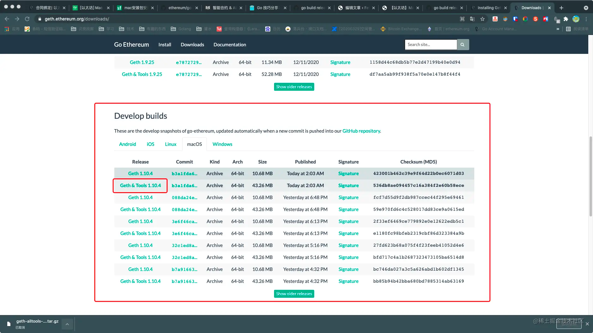

# Go调用以太坊Solidity合约

## Mac安装abigen

下载build工具: https://geth.ethereum.org/downloads/



```shell
tar zxvf geth-alltools-darwin-amd64-1.10.21-67109427.tar.gz
cd geth-alltools-darwin-amd64-1.10.21-67109427
./abigen --help
```

将.abi转成go代码
```shell
abigen -abi Storage.abi -type Storage -pkg contracts -out Storage.go
```
- abi：要绑定的以太坊合约abi json的路径，-用于STDIN 以太坊合约字节码的路径(生成部署方法)
- type：绑定的结构名称(默认=包名)
- pkg：要生成绑定到的包名,生成的绑定的输出文件(默认= stdout),绑定的目标语言(go, java, objc)(默认值:“go”)
- out：输出文件名

## 调用示例

[main.go](main.go)
